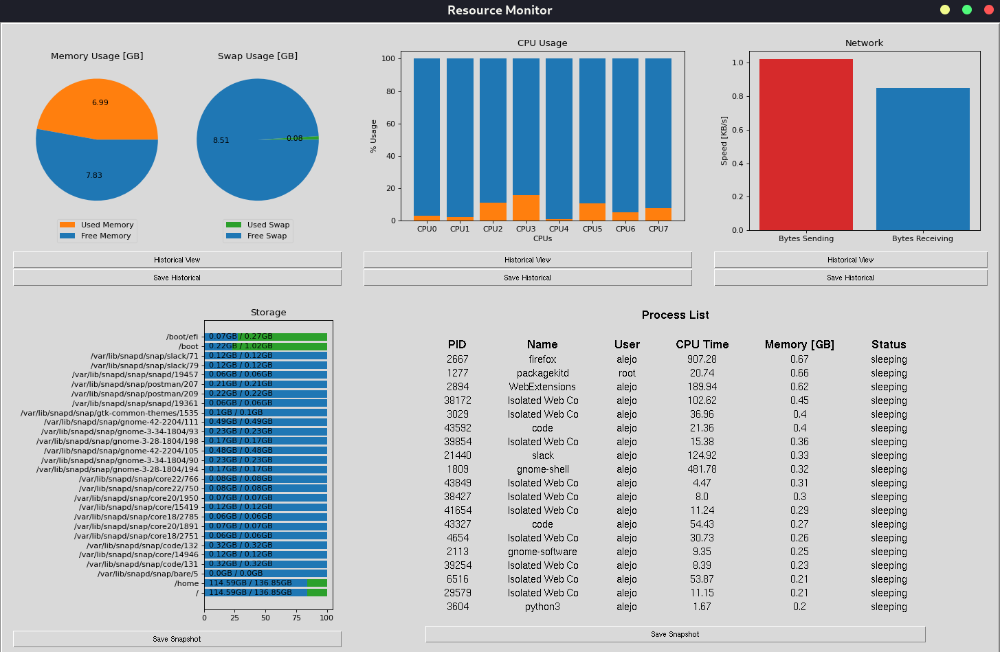
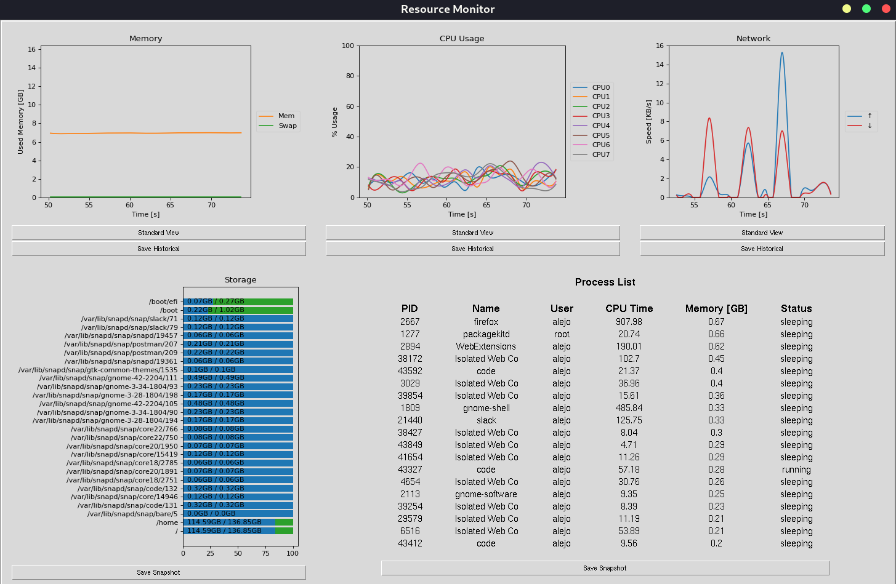
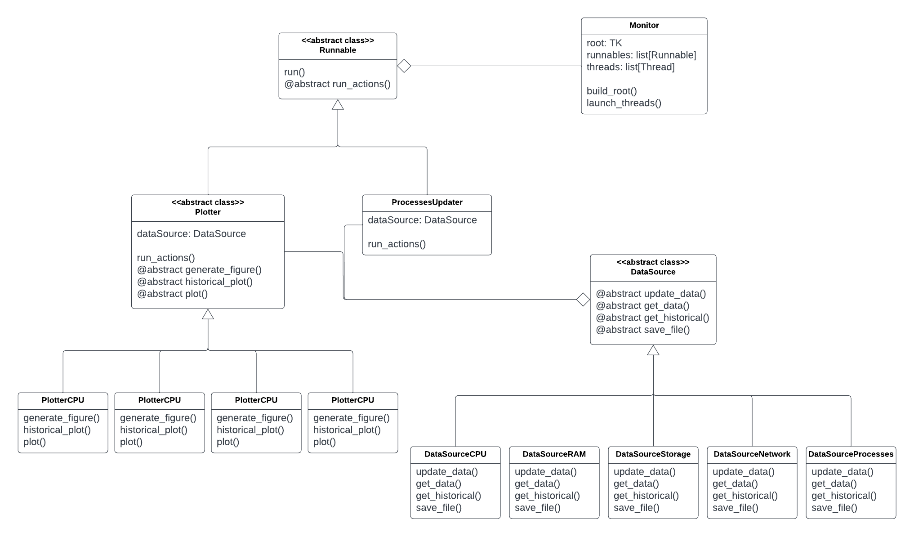

# OS-Resource-Monitor

# Technologies
Python
* GUI (tkinter)
* Plotting (matplotlib, pandas)
* Parallelization (threading)
* System information (psutil)

# Monitor
Python implementation of a real-time monitor for compute resources
* RAM
* CPU
* Network
* Storage
* Processes

## Standard View

## Historical View

# Class Diagram

MVC implementation
* Model (DataSources)
* View (Monitor)
* Controller (Runnables: Plotters/ProcessesUpdater)

